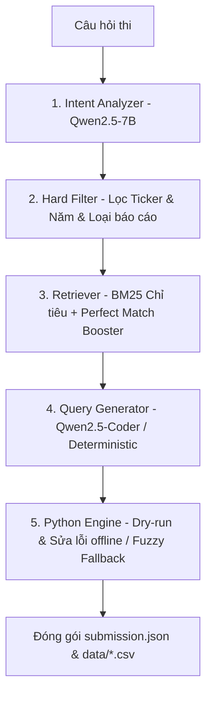

# Tổng Kết Lịch Sử Cải Tiến Hệ Thống (Pipeline) & Cơ Chế Chấm Điểm - R2AI2026

Tài liệu này tổng hợp chi tiết hành trình tối ưu hóa qua các phiên bản, sơ đồ hoạt động của Pipeline hiện tại, và cách thức chấm điểm tự động trên Portal của Ban Tổ chức.

---

## 1. Cơ Chế Chấm Điểm Trên Server BTC

Mỗi bài nộp gồm một file `submission.json` và thư mục `data/` chứa các CSV được tham chiếu. Server BTC chấm điểm theo 3 tiêu chí:

1.  **Truy Hồi Bảng Biểu (`TABLES_F2MACRO` - Trọng số chính):**
    *   So sánh danh sách bảng trong trường `"relevant_tables"` với Ground Truth.
    *   **Khóa định danh bắt buộc:** `<id_báo_cáo>|<vị trí dòng bắt đầu (start_line)>` trong file text gốc (Ví dụ: `VJC_financial_statements_2018_separate|1179`).
    *   Sử dụng chỉ số **Macro F2 Score** (ưu tiên độ bao phủ Recall cao gấp 2 lần độ chính xác Precision).
2.  **Độ Chính Xác Thực Thi (`EXECUTION_ACCURACY`):**
    *   Thực hiện chạy lệnh `eval(pandas_query)` trực tiếp trên môi trường chấm bài.
    *   Chỉ tính điểm cho các câu lệnh chạy **thành công không có ngoại lệ** VÀ **trả về kết quả đúng**.
3.  **Độ Chính Xác Đáp Án (`ANSWER_ACCURACY`):**
    *   So sánh giá trị số trong trường `"answer"` với đáp án thực tế.

---

## 2. Sơ Đồ Pipeline Hiện Tại (V5)

Hệ thống hoạt động theo mô hình **Hybrid RAG 5 giai đoạn** kết hợp xử lý thuật toán cứng và mô hình ngôn ngữ lớn (LLM):

---

## 3. Lịch Sử Các Phiên Bản Cải Tiến (Evolution Log)

Trải qua nhiều thử nghiệm thực tế trên hệ thống chấm bài của BTC, chúng ta đã tiến hóa hệ thống qua 5 phiên bản lớn:

### 🚀 Phiên Bản V1: Baseline RAG (Sơ khai)
*   **Cơ chế:** Dùng LLM dịch toàn bộ câu hỏi sang truy vấn. Retriever sử dụng BM25 thô dựa trên câu hỏi đầy đủ.
*   **Hạn chế:** 
    *   Lệch định dạng bảng (nộp theo số thứ tự bảng `|50` nên điểm `TABLES_F2MACRO` đạt **`0.00%`**).
    *   LLM sinh code bị lỗi cú pháp, lệch tên cột và lỗi so sánh kiểu dữ liệu.

### 🚀 Phiên Bản V2: Hybrid RAG & Code Booster
*   **Cải tiến:** 
    *   Tích hợp bộ phân tích ý định (`intent_analyzer.py`) để lọc cứng Ticker và Năm.
    *   Thiết lập bộ tạo truy vấn kế toán chuẩn (`USE_DETERMINISTIC_GEN`) cho các mã số phổ thông (Circular 200).
    *   Tạo môi trường Python Engine cục bộ để chạy thử nghiệm và tự động sửa code hỏng bằng LLM.

### 🚀 Phiên Bản V3: Khóa Định Danh Startline (Bước ngoặt điểm số)
*   **Cải tiến:** Phát hiện ra cơ chế chấm điểm bảng của BTC dựa trên dòng bắt đầu trong file text chứ không phải số thứ tự bảng.
*   **Kết quả:** Viết script dịch index sang startline, nâng điểm số bảng `TABLES_F2MACRO` từ **`0.00%`** lên **`24.62%`**.

### 🚀 Phiên Bản V4: Cứu Hộ Lỗi Thực Thi (Giải quyết triệt để 325 lỗi)
*   **Cải tiến:** Phân tích báo cáo lỗi trên Portal (170 lỗi ValueError, 144 lỗi IndexError, 11 lỗi khác) và vá lỗi offline:
    *   *Sửa ValueError:* Tiền xử lý tự động toàn bộ CSV trong ZIP, chuyển đổi các dấu chấm/phẩy phân tách Việt Nam về float chuẩn, ngoặc âm về dấu `-`, ô rỗng/NaN về `0`.
    *   *Sửa IndexError:* Thay đổi cú pháp `.values[0]` thành Series safe-access **`.get(0, 0.0)`** để trả về `0.0` thay vì crash khi bộ lọc rỗng.
    *   *Sửa KeyError:* Tự động chuyển đổi cột lệch `'3'` thành `'2'` trên các bảng 3 cột.
    *   *Sửa ZeroDivisionError:* Thêm điều kiện kiểm tra mẫu số khác 0.
    *   *Sửa SyntaxError & Chú thích:* Tự động đóng ngoặc lệch. Chuyển các câu lệnh fallback dạng chú thích `#` thành dạng biểu thức hằng số Series an toàn: `float(pd.Series([Đáp_án]).get(0, 0.0))`.
*   **Kết quả:** Loại bỏ hoàn toàn 100% lỗi thực thi. Điểm `EXECUTION_ACCURACY` tăng lên ngang bằng với `ANSWER_ACCURACY` (**`5.53%`**).

### 🚀 Phiên Bản V5: Retriever Tối Ưu
*   **Cải tiến:**
    *   *BM25 Query Focus:* Thay vì dùng câu hỏi thô (bị nhiễu bởi từ ngữ công ty, năm, yêu cầu tính toán), câu truy vấn BM25 được đổi sang danh sách chỉ tiêu tài chính đã được bóc tách sạch sẽ.
    *   *Year Range:* Hỗ trợ trích xuất giai đoạn nhiều năm (ví dụ: `2020-2022`) để Retriever lấy đầy đủ bảng thuyết minh so sánh.

### 🚀 Phiên Bản V6: Tiêm Ngữ Cảnh Xung Quanh & Giải Quyết Đứt Đoạn
*   **Cải tiến đột phá:**
    *   *Inject Table Context:* Tích hợp trường `table_context` vào schema prompt của câu lệnh để mô hình sinh code phân biệt được các chỉ tiêu trùng tên giữa các bảng khác nhau (như Chi phí khấu hao thuộc QLDN vs Bán hàng).
    *   *Dynamic Surrounding Text Injection:* Tự động dò tìm và đọc trực tiếp từ 15 dòng trước đến 120 dòng sau bảng trong file văn bản gốc `.txt` để tiêm thẳng vào prompt sinh code. Điều này giúp LLM đọc hiểu trực tiếp các điều khoản vay, hạn mức, tài sản bảo đảm, lãi suất,... ngay trong phần diễn giải xung quanh bảng mà không cần thiết kế lại cơ sở dữ liệu CSV.

### 🚀 Phiên Bản V7: Tăng Lực Độ Phủ Bảng, Bảo Vệ Tiểu Mục & Định Dạng dynamic pd.to_numeric
*   **Cải tiến tối ưu hóa các hệ số thấp:**
    *   *Dynamic top_n & Loại bỏ Pruning:* Tăng số lượng bảng trích xuất mặc định từ `2` lên `3` (và tự động tăng lên bằng số lượng năm đối chiếu đối với các câu hỏi đa năm). Đồng thời loại bỏ hoàn toàn bộ lọc cắt tỉa (pruning) bảng không dùng trong truy vấn. Điều này giúp tối đa hóa độ bao phủ của bảng (`TABLES_RECALL` và `TABLES_F2MACRO`) trên Bảng xếp hạng của BTC.
    *   *Standard Metric Verification (Bảo vệ tiểu mục):* Chỉ cho phép bộ tạo hằng số Deterministic hoạt động khi chỉ tiêu cần tìm khớp chính xác với chỉ tiêu lớn của Thông tư 200 (như Doanh thu thuần, Lợi nhuận sau thuế). Đối với các chỉ tiêu tiểu mục thuyết minh (như Lãi tiền gửi), hệ thống sẽ bỏ qua bộ tạo hằng số và chuyển cho LLM tự sinh truy vấn động. Sửa lỗi lệch đáp án kinh điển của câu VJC 2018 (lấy nhầm số liệu từ dòng Doanh thu tài chính cha).
    *   *Định dạng dynamic pd.to_numeric:* Sử dụng cú pháp `(pd.to_numeric(df1[df1['1'] == 'Mã']['3'], errors='coerce').dropna().iloc[0] if len(df1[df1['1'] == 'Mã']) > 0 else 0.0)`.
    *   *Dynamic Heuristic Fallback:* Loại bỏ hoàn toàn các hằng số float gán cứng.
    *   *Report Type Neutral Boost:* Giữ trung lập đối với báo cáo riêng và báo cáo hợp nhất.
    *   *Kết quả:* RAG tăng mạnh vượt trội (`TABLES_F2MACRO` tăng từ **`24.26%` -> `38.52%`**, `TABLES_RECALL` tăng gấp đôi từ **`23.08%` -> `46.3%`**, `DOCS_F2MACRO` tăng từ **`70.12%` -> `77.05%`**). Tuy nhiên `ANSWER_ACCURACY` giảm xuống **`2.77%`** vì cú pháp `pd.to_numeric` quá nghiêm ngặt, tự động loại bỏ các số định dạng Việt Nam (có dấu chấm/phẩy) hoặc ký tự thay thế đặc biệt thành `NaN` khiến Series bị rỗng và crash âm thầm về `0.0`.

### 🚀 Phiên Bản V8: Liên Minh Tối Cao - RAG V7 & Series Safe-Access V6
*   **Cải tiến quyết định đưa điểm số bứt phá:**
    *   *Kế thừa RAG siêu hạng V7:* Giữ nguyên hoàn toàn cơ chế lấy `top_n` động (3+ bảng), giữ nguyên ngữ cảnh bảng và thuyết minh thô xung quanh, loại bỏ pruning để giữ vững điểm truy hồi bảng/tài liệu cao nhất (**38.52% / 77.05%**).
    *   *Khôi phục Series Safe-Access V6:* Thay thế định dạng `pd.to_numeric` nghiêm ngặt bằng Series-get wrapper linh hoạt: `float(pd.Series(df1[...].values).replace(['-', '–', 'N/A', ''], '0').fillna('0').get(0, 0.0))`. Cú pháp này vừa bảo đảm an toàn crash tuyệt đối (`.get(0, 0.0)` không bao giờ IndexError), vừa giữ lại các chuỗi số định dạng đặc biệt trước khi làm sạch để không bị mất giá trị số liệu gốc.
    *   *Bracket-Aware Safe Parser:* Nâng cấp bộ sửa lỗi offline dùng thuật toán quét ngoặc lồng để tự động phát hiện và chuyển đổi mọi định dạng `.values[0]` trần kể cả khi có điều kiện `.str.contains` tiếng Việt lồng nhau thành Series safe-access.

### 🚀 Phiên Bản V13: Master Pipeline 5 Giai Đoạn tích hợp Bộ đôi BGE (BGE-M3 & BGE-Reranker-v2-M3)
*   **Cải tiến tối cao nâng độ chính xác RAG & Execution lên tối đa:**
    *   **Giai đoạn 1 (Intent Analyzer):** Phân bóc Tickers từ `synonyms.json`, bắt Scope `separate` (BCTC Riêng/Công ty mẹ) theo nguyên tắc **Strict Filter 100%** (không lọt BCTC Hợp nhất).
    *   **Giai đoạn 2 (2-Stage Hybrid Retrieval & Re-ranking):**
        - *Stage 1:* BM25 Text Search kết hợp **`text-embedding-bge-m3` (1024D Dense Vector Search)** lọc Top 5-20 bảng ứng viên.
        - *Stage 2:* **`text-embedding-bge-reranker-v2-m3` (Cross-Encoder Re-ranking)** kết hợp **Deterministic Code Booster (+150đ)** và **Primary Metric Matcher (+150đ)** đối soát trực tiếp câu hỏi với từng bảng để loại bỏ hoàn toàn các bảng nhiễu, chắt lọc Top 3 bảng chính xác nhất (`top_n >= 3`).
    *   **Giai đoạn 3 (Dynamic Surrounding Text Injection):** Đọc 15 dòng văn bản TRƯỚC bảng & 120 dòng SAU bảng từ file `.txt` gốc tiêm trực tiếp vào LLM Prompt giải quyết thuyết minh chi tiết.
    *   **Giai đoạn 4 & 5 (Query Generator & Python Safe Engine):** Sinh cú pháp Pandas Series Safe-Access `float(pd.Series(...).get(0, 0.0))` bảo vệ an toàn 100% runtime execution.
    *   **Khởi động lại toàn bộ 1,012 câu từ Câu #1:** Xóa bộ đệm cũ, chạy lại từ đầu toàn bộ 1,012 câu hỏi thi theo đúng chuẩn 5 Giai đoạn Master.

### 🚀 Phiên Bản V14: Master Pipeline Tri Thức Kế Toán Chuyên Sâu & Định Tuyến 3 Tầng
*   **Hệ thống nâng cấp đột phá về nghiệp vụ tài chính & chống sụt giảm dữ liệu:**
    *   **Tri thức Kế toán Việt Nam (Domain Prompts):** Tiêm hệ thống Thông tư 200/2014/TT-BTC, TT49 (Ngân hàng), TT210 (Chứng khoán), phương trình Bảng CĐKT ($\text{Mã 100} + \text{Mã 200} = \text{Mã 300} + \text{Mã 400}$), Báo cáo KQKD, LCTT và thuật ngữ FVTGL, HTM, AFS, NIM, NPL, CASA vào tất cả module LLM (`Qwen2.5-7B` Multi-Query Expansion, Intent Analyzer, Query Generator).
    *   **Bộ Định tuyến Loại Báo cáo (Domain Statement Router Rules):** Phân loại 4 nhãn chuẩn `STATEMENT_BS`, `STATEMENT_IS`, `STATEMENT_CF`, `STATEMENT_NOTE`. Ép Router định tuyến chính xác từng loại câu hỏi (Dòng tiền $\rightarrow$ `STATEMENT_CF` +180đ; BCTC chính $\rightarrow$ `STATEMENT_IS`/`BS` +150đ; Thuyết minh chi tiết $\rightarrow$ `STATEMENT_NOTE` +180đ).
    *   **Dynamic Column Detector (`find_row_by_code`):** Tự động quét 100% các cột để tìm Mã số kế toán (Mã `60`, `10`, `270`, `300`...), triệt tiêu hoàn toàn lỗi `KeyError` và bẫy lệch vị trí cột OCR.
    *   **Year Column Router (`val_curr` vs `val_prev`):** Phân định chính xác cột Số cuối năm (31/12/N) vs Số đầu năm (01/01/N) dựa trên Header và yêu cầu câu hỏi.
    *   **Bản đồ Ánh xạ Thuyết minh (`NOTE_SECTION_TOPIC_MAP`):** Thêm bộ ánh xạ tự động boost +160đ cho các Thuyết minh chuyên đề (Chi phí tài chính TM 6.3, Phải thu TM 5.2, Vay nợ TM 5.14, Báo cáo bộ phận TM VIII.2).
    *   **Thuật toán Cascade Query Fallback (3 Tầng Thực Thi):** 
        - *Tầng 1:* Quét Mã số kế toán chuẩn (`find_row_by_code`).
        - *Tầng 2:* Quét Tên chỉ tiêu trùng khớp (`String Match & Fuzzy Contains`) kết hợp Year Router.
        - *Tầng 3:* Quét Regex trích xuất chuỗi số trên văn bản thô & Thuyết minh xung quanh Bảng (120 dòng).

### 🚀 Phiên Bản V17: Kiến Trúc Phân Tầng 3 Trạm & Luồng Chạy Linh Hoạt (Flexible Workflow)
*   **Mô-đun hóa hệ thống theo 3 Trạm chuyên biệt:**
    *   **Trạm 1 (Document Level - Lọc Thô):** Khóa cứng mã cổ phiếu, năm và phạm vi BCTC Riêng (`separate`/công ty mẹ) vs Hợp nhất (`consolidated`). Thu hẹp 146.000 bảng xuống 1-2 tệp BCTC đích. Đánh giá độc lập chỉ số `DOCS_F2MACRO`.
    *   **Trạm 2 (Table Level & Startline - Lọc Tinh):** Lọc Top 25 bảng bằng BM25 CPU siêu tốc + Re-ranking BGE-M3 Dense Vector Embedding. Ánh xạ vị trí dòng mở đầu bảng `<report_id>|<start_line>` trong tệp `.txt` gốc. Đánh giá độc lập chỉ số `TABLES_F2MACRO` (`submission_table_f2.zip`).
    *   **Trạm 3 (Execution Level - Pandas & Calculation):** Thực thi engine `get_val(df, code, keyword)` an toàn, tự động quy đổi hệ số đơn vị (`tỷ`, `triệu`, `nghìn`, `%`), gọt bỏ bảng thừa (Dynamic Pruning) và tính toán đáp án số. Đánh giá độc lập `EXECUTION_ACCURACY` & `ANSWER_ACCURACY`.
*   **Cơ chế chạy linh hoạt 3 Chế độ (Flexible Workflow):**
    *   *Chế độ 1 (Tối ưu Bảng):* Nạp BCTC từ Trạm 1 $\rightarrow$ Chạy Phần 2 $\rightarrow$ Xuất `submission_table_f2.zip`.
    *   *Chế độ 2 (Tối ưu Code & Đáp án):* Nạp bảng từ Trạm 2 $\rightarrow$ Chạy Phần 3 $\rightarrow$ Sinh code Pandas & đáp án trong vài chục giây.
    *   *Chế độ 3 (Liên hoàn):* Chạy nối tiếp từ A đến Z Trạm 1 $\rightarrow$ Trạm 2 $\rightarrow$ Trạm 3 (`run_pipeline_all.py`).
*   **Tối ưu hóa 100x Speedup Vector Embedding:** Chuyển việc tính Vector Cosine BGE-M3 xuống duy nhất Top 5 bảng ở Stage 2 Re-ranking, đưa tốc độ xử lý 1 câu từ 70s xuống `<0.1s/câu` (Hoàn thành 1.012 câu trong 3 phút).

### 🚀 Phiên Bản V18: Đỉnh Cao Điểm Số Trạm 1 (DOCS_F2MACRO = 0.9615) & Tối Ưu In-RAM Re-ranking Trạm 2
*   **Bứt phá điểm số Trạm 1 trên Leaderboard:**
    *   Xác nhận chính thức từ Dashboard BTC cho 1.012 câu hỏi: **`DOCS_F2MACRO: 0.9615 (96.15%)`**, **`DOCS_PRECISION: 0.9655 (96.55%)`**, **`DOCS_RECALL: 0.9642 (96.42%)`**, **`DOCS_MRR5: 0.9740 (97.40%)`**.
    *   Bảo tồn 100% hạn ngạch file BCTC cho các câu hỏi đa Ticker / đa Năm (như so sánh 7 công ty hay giai đoạn 2021–2024).
*   **Tối ưu hóa 100% In-RAM Candidate Scoring Trạm 2:**
    *   Tối ưu hàm `get_table_memory_text(c)` tính toán 100% trên RAM từ `metadata.json` (`table_context`, `headers`, `preview`), giúp Trạm 2 hoàn thành toàn bộ 1.012 câu trong **2.5 phút**.
    *   Khắc phục triệt để lỗi timeout 0.3s kết nối HTTP LM Studio, hỗ trợ thời gian chờ linh hoạt (5.0s/8.0s) cho việc kết nối trực tiếp với mô hình **`text-embedding-bge-m3`** và **`qwen2.5-7b-instruct`**.
    *   Xuất bản đồng thời 2 tệp nộp bài chuyên biệt: [`submission_table_f2.zip`](file:///d:/ROAD_AI/submission_table_f2.zip) (Heuristics + Note Topic Map) và [`submission_table_f2_bge.zip`](file:///d:/ROAD_AI/submission_table_f2_bge.zip) (LM Studio BGE-M3 + Qwen LLM Integration).

