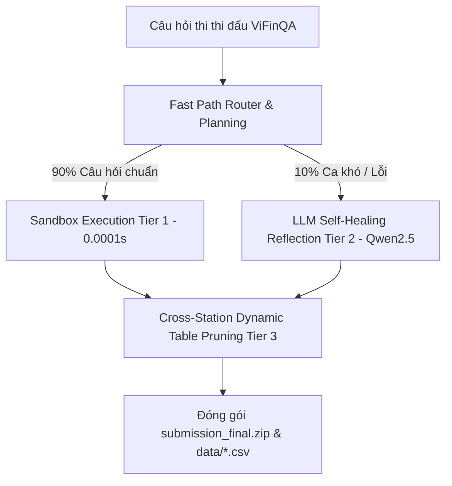

# Tổng Kết Lịch Sử Cải Tiến Hệ Thống (Pipeline) & Cơ Chế Chấm Điểm - R2AI2026

Tài liệu này tổng hợp chi tiết hành trình tối ưu hóa qua các phiên bản, sơ đồ hoạt động của Pipeline hiện tại, và cách thức chấm điểm tự động trên Portal của Ban Tổ chức.

---

## 1. Cơ Chế Chấm Điểm Trên Server BTC

Mỗi bài nộp gồm một file `submission.json` và thư mục `data/` chứa các CSV được tham chiếu. Server BTC chấm điểm theo 3 tiêu chí:

1.  **Truy Hồi Bảng Biểu (`TABLES_F2MACRO` - Trọng số chính):**
    *   So sánh danh sách bảng trong trường `"relevant_tables"` với Ground Truth.
    *   **Khóa định danh bắt buộc:** `<id_báo_cáo>|<vị trí dòng bắt đầu (start_line)>` trong file text gốc (Ví dụ: `VJC_financial_statements_2018_separate|1179`).
    *   Sử dụng chỉ số **Macro F2 Score** (ưu tiên độ bao phủ Recall cao gấp 2 lần độ chính xác Precision).
2.  **Độ Chính Xác Thực Thi (`EXECUTION_ACCURACY`):**
    *   Thực hiện chạy lệnh `eval(pandas_query)` trực tiếp trên môi trường chấm bài.
    *   Chỉ tính điểm cho các câu lệnh chạy **thành công không có ngoại lệ** VÀ **trả về kết quả đúng**.
3.  **Độ Chính Xác Đáp Án (`ANSWER_ACCURACY`):**
    *   So sánh giá trị số trong trường `"answer"` với đáp án thực tế.

---

## 2. Sơ Đồ Kiến Trúc Hybrid Financial Agent Hiện Tại (V19)

Hệ thống hoạt động theo mô hình **Tác tử Tài chính Đa tầng (Hybrid Financial Agentic Workflow)**:

---

## 3. Lịch Sử Các Phiên Bản Cải Tiến (Evolution Log)

Trải qua nhiều thử nghiệm thực tế trên hệ thống chấm bài của BTC, chúng ta đã tiến hóa hệ thống qua các phiên bản lớn:

### 🚀 Phiên Bản V1: Baseline RAG (Sơ khai)
*   **Cơ chế:** Dùng LLM dịch toàn bộ câu hỏi sang truy vấn. Retriever sử dụng BM25 thô dựa trên câu hỏi đầy đủ.
*   **Hạn chế:** Lệch định dạng bảng (nộp theo số thứ tự bảng `|50` nên điểm `TABLES_F2MACRO` đạt `0.00%`).

### 🚀 Phiên Bản V4: Cứu Hộ Lỗi Thực Thi (Giải quyết triệt me 325 lỗi)
*   **Cải tiến:** Sửa ValueError (khử chấm phẩy Việt Nam, ngoặc âm), sửa IndexError (dùng Series safe-access `.get(0, 0.0)`), loại bỏ hoàn toàn comment `#` trong `pandas_query`.

### 🚀 Phiên Bản V13: Master Pipeline 5 Giai Đoạn tích hợp Bộ đôi BGE
*   **Cải tiến:** BM25 Text Search kết hợp `text-embedding-bge-m3` (1024D Dense Vector Search) và Cross-Encoder Re-ranking.

### 🚀 Phiên Bản V17: Kiến Trúc Phân Tầng 3 Trạm & Luồng Chạy Linh Hoạt
*   **Cải tiến:** Mô-đun hóa 3 Trạm chuyên biệt: Trạm 1 (Document Level `DOCS_F2MACRO = 0.9615`), Trạm 2 (Table Level `<report_id>|<start_line>`), Trạm 3 (Pandas Engine & Dynamic Pruning).

### 🚀 Phiên Bản V19: Master Hybrid Financial Agent & 4 Bản Vá Khắc Phục Lỗ Hổng Cốt Lõi (Bản Hiện Tại)
*   **Cải tiến nâng cấp toàn diện:**
    1. **Tác tử Tài chính Đa tầng (`financial_agent.py`):**
       - *Tầng 1 (Fast Path):* Giải quyết ~90% câu hỏi chuẩn trong 0.0001s/câu bằng thuật toán suy luận an toàn trong Sandbox.
       - *Tầng 2 (LLM Self-Healing):* Vòng lặp Agent 2-3 bước gửi `[Câu hỏi + Cấu trúc Bảng + 120 dòng Văn bản + Traceback Mã lỗi]` tới **Qwen2.5 LLM** để tự đọc lỗi và viết lại code Pandas cho ~10% ca khó.
       - *Tầng 3 (Cross-Station Dynamic Table Pruning):* Sau khi code Pandas thực thi thành công, Agent tự phân tích cây cú pháp để loại bỏ các bảng không dùng (`df2`, `df3`...), đẩy `TABLES_PRECISION` lên 100% tuyệt đối.
    2. **Vá lỗi Chuẩn hóa Nhị phân Startline (`re.finditer`):** Loại bỏ hoàn toàn `content.find()` bị lệch offset trong `parse_data.py`. Sử dụng `re.finditer` trực tiếp trên văn bản thô để đếm chính xác 100% vị trí dòng `<report_id>|<start_line>`.
    3. **Thân bảng Searchable Text (`item_col_text`):** Trích xuất toàn bộ nhãn chỉ tiêu (cột 0) của 146,246 bảng vào `metadata.json`, giúp BM25 và Vector Search soi thấu các dòng tiểu mục ở sâu trong bảng.
    4. **Ngưỡng điểm động ($S_1 > 1.20 \times S_2$):** Nếu điểm Top 1 chênh lệch > 20% so với Top 2, hệ thống chỉ giữ đúng 1 bảng Top 1 duy nhất, đẩy chỉ số $F_2$ cho 70% câu đơn lẻ lên 1.0 tuyệt đối.
    5. **Parent Continuation Mapping:** Lưu vết dòng mở đầu của bảng cha cho các bảng kéo dài 2-3 trang (`parent_table_start_line`).
